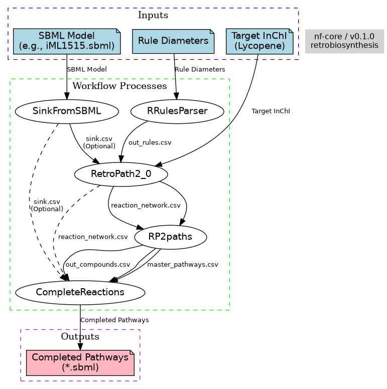

# Nextflow_Retrobiosynthesis

This project is submitted to ISMB-ECCB 2025.

### Workflow Diagram

Here's a high-level overview of the Nextflow retrobiosynthesis workflow:

## Go with the (Next)flow: Retrobiosynthesis

[Emre Taha Çevik](https://github.com/bogrum), [Gülce Çelen](https://github.com/GulceC), [Nilay Yönet](https://github.com/niraito), [Kübra Narcı](https://github.com/kubranarci)

 

**Source Code:** [https://github.com/niraito/Nextflow_Retrobiosynthesis](https://github.com/niraito/Nextflow_Retrobiosynthesis)

**License:** [Apache 2.0 license](https://www.apache.org/licenses/LICENSE-2.0)

Scientific workflows in synthetic biology and metabolic engineering increasingly rely on automation to enhance reliability, efficiency, and flexibility. Nextflow is a code-centric workflow management system built for scalable, reproducible, and robust data analysis. Its scriptable domain-specific language and container-native architecture enable the integration of pipelines written in any scripting language without reimplementation of existing pipelines, while its data streaming feature allows efficient and scalable workflow design. Despite these strengths, Nextflow's adoption in synthetic biology is still limited. 

One of the essential approaches in synthetic biology is retrobiosynthesis. Retrosynthesis algorithms enable the identification of biosynthetic pathways by working backward from target compounds to precursor metabolites available in the host organism. This approach facilitates the exploration of known and novel routes and supports pathway feasibility assessment, enzyme selection, and ranking based on thermodynamics, flux analysis, and host compatibility. Advances in these algorithms have accelerated the systematic engineering of microbial strains for natural and synthetic product biosynthesis. 

To meet the demand for automated and standardized pathway design, several open-source tools such as RetroPath2.0, BioNavi, and RetroBioCat have been developed. However, these tools are limited by reduced parameter flexibility, tool integration, and runtime control due to their GUI-centered design. Nextflow addresses these challenges by enabling modular, scalable, and reproducible pipelines with complex branching logic and containerized multi-tool integration.

This work aims to develop and improve a Nextflow pipeline for retrobiosynthesis. We expect this pipeline to constitute a base for future computational workflows to extend synthetic biology tools for pathway design and strain engineering.

**Keywords:** Nextflow, Retrosynthesis, Synthetic Biology, Pathway Design, Workflow Management
